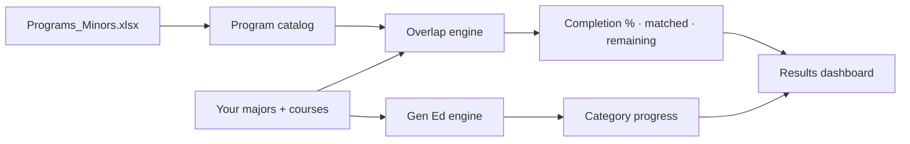

<div align="center">

# [IlliniOverlap](https://illini-overlap.vercel.app/)

**Turn the courses you're already taking into minors and certificates you didn't know you were earning.**

*Built for Illini, by Illini — University of Illinois Urbana-Champaign*

<br />

[](https://nextjs.org/)
[](https://www.typescriptlang.org/)
[](https://tailwindcss.com/)

</div>

---

## Why this matters

Every semester, thousands of Illinois students stack up credit hours that *could* count toward a minor or certificate — but never find out until it's too late. Degree audits show what you've completed. They don't show **what you're one or two classes away from**.

**IlliniOverlap closes that gap.**

| The problem today | What IlliniOverlap does |
|-------------------|-------------------------|
| Minors and certificates are buried in PDF handbooks and scattered department pages | One searchable dashboard across **every** minor and certificate in the catalog |
| Students guess whether a class "counts" for something else | Instant **completion %** with matched courses and remaining requirements |
| Planning means hours with an advisor or spreadsheet | A **4-step wizard** — major, courses, verify, results — in minutes |
| Transcripts and advising reports are hard to translate into a plan | **Upload your UIUC Academic Advising Report** and pull courses automatically |
| Gen Ed feels like a checklist with no payoff | See which Gen Ed categories your courses already satisfy |

> **The stakes are real.** Extra semesters cost time, money, and momentum. A minor that shares 80% of your major requirements isn't a nice-to-have — it's leverage: stronger transcripts, sharper skill stacks, and credentials earned *without* buying more seat time than you need.

IlliniOverlap isn't a replacement for academic advising. It's the **discovery layer** advisors wish every student had *before* the appointment — so conversations shift from *"What are my options?"* to *"Which of these three overlaps should I prioritize?"*

---

## What you get

```
   ┌─────────────┐     ┌─────────────┐     ┌─────────────┐     ┌──────────────────────┐
   │  1. Profile │ ──▶ │  2. Courses │ ──▶ │  3. Verify  │ ──▶ │  4. Results dashboard │
   │  Your major │     │  Add/upload │     │  Review list│     │  Minors · Certs · Gen Ed│
   └─────────────┘     └─────────────┘     └─────────────┘     └──────────────────────┘
```

### Smart overlap analysis

Enter the courses you've taken, are taking, or plan to take. IlliniOverlap runs them against the full program catalog and surfaces:

- **Completion percentage** for each minor and certificate
- **Matched courses** — what already counts and why
- **Remaining requirements** — what's left, including elective pools and advanced-hour rules
- **Eligibility filters** — programs excluded by your major are flagged, not hidden silently
- **Confidence signals** — so you know when a result is exact vs. needs a human check

### Advising-report import

Drop in your **UIUC Academic Advising Report** PDF. The parser targets the *Courses counting toward total hours* section — the same source advisors trust — so you're not re-typing twenty course codes by hand.

Also supports manual search, paste-from-spreadsheet, DOCX, and XLSX.

### Gen Ed, connected to your plan

Gen Ed requirements aren't an afterthought. The results dashboard shows which **parent categories** your coursework already covers, helping you see how exploratory electives and major requirements double as progress toward breadth — not just toward a credential.

### Built for real catalog complexity

Illinois programs aren't uniform. Some require advisor approval. Some cap overlapping hours. Some split electives into pools with 300/400-level minimums. IlliniOverlap encodes those rules so the numbers you see reflect **how the catalog actually works**, not a simplified guess.

---

## Who it's for

| Audience | How IlliniOverlap helps |
|----------|-------------------------|
| **Students** | Find high-overlap minors early; avoid redundant credit hours; walk into advising with a shortlist |
| **Peer mentors & RSOs** | Demo credential stacking in workshops without maintaining a spreadsheet |
| **Developers at Illinois** | Open, testable overlap engine on canonical `Programs_Minors` data — extend, don't reinvent |

---

## Quick start

```bash
git clone https://github.com/dvjgenis/Illini_Overlap.git
cd Illini_Overlap
npm install
make dev
```

Open **[http://localhost:3000](http://localhost:3000)** and walk through the wizard.

### Commands

| Command | Description |
|---------|-------------|
| `make dev` | Start the development server |
| `make build` | Production build |
| `make start` | Run the production server |
| `make lint` | ESLint |
| `make test` | Vitest unit tests |

---

## Under the hood



| Layer | Stack |
|-------|-------|
| App | Next.js 14 · React · TypeScript |
| UI | Tailwind CSS · Radix UI · Framer Motion |
| Logic | `lib/calculation-engine.ts` · `lib/gen-ed-engine.ts` · `lib/advising-report-parser.ts` |
| Data | `rawdata/Programs_Minors.xlsx` → served at runtime (CSV fallback supported) |

Deeper docs live in [`docs/context/product-spec.md`](docs/context/product-spec.md) and [`docs/context/system-map.md`](docs/context/system-map.md).

---

## Project structure

```
Illini_Overlap/
├── app/                  # Next.js App Router pages
├── components/           # Wizard steps, results UI, design system
├── lib/                  # Overlap engine, Gen Ed logic, PDF parser, data loaders
├── context/              # Program + user state (majors, courses)
├── public/               # Program dataset served to the client
├── rawdata/              # Source Excel for minors & certificates
├── tests/                # Unit tests (engines, parsers, loaders)
├── docs/                 # Product spec, system map, ADRs, progress log
└── Makefile              # Standard dev commands
```

---

## Contributing & development

1. Read [`docs/plan.md`](docs/plan.md) before large changes.
2. Run `make test` and `make lint` before opening a PR.
3. Architectural decisions belong in [`docs/adr/`](docs/adr/).
4. Update [`docs/progress.md`](docs/progress.md) when direction or blockers change.

**For AI-assisted development:** pin `@docs/plan.md` and `@docs/progress.md`; use Makefile targets instead of guessing CLI flags.

---

<div align="center">

**One schedule. More credentials. Less waste.**

*IlliniOverlap — see what your transcript is already worth.*

<br />

University of Illinois Urbana-Champaign

</div>
