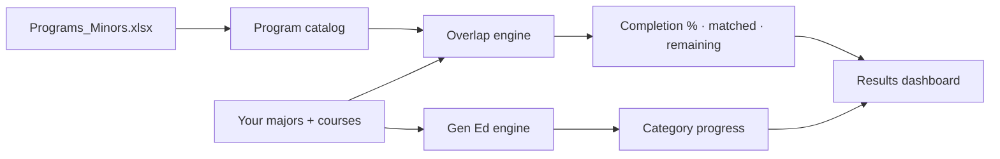

<div align="center">

# IlliniOverlap

[](https://illini-overlap.vercel.app/)
[](https://nextjs.org/)
[](https://www.typescriptlang.org/)
[](https://illinois.edu/)

**TL;DR — One sentence:** IlliniOverlap shows Illinois students which minors and certificates they're *already close to finishing* — based on courses they've taken — so they can earn more credentials without wasting semesters.

**Tagline:** More credentials. Less waste.

*Built for Illini, by Illini — University of Illinois Urbana-Champaign*

[Try the live app](https://illini-overlap.vercel.app/) · [Why it matters](#why-this-matters) · [Quick start](#quick-start) · [Architecture](#under-the-hood)

</div>

---

## What this is (in plain English)

Degree audits tell you what you've finished. They **don't** tell you what you're one or two classes away from.

IlliniOverlap is a 4-step wizard:

1. **Profile** — your major(s)  
2. **Courses** — add manually or upload your advising report  
3. **Verify** — review the list  
4. **Results** — completion % for minors, certificates, and Gen Ed progress  

Upload a UIUC Academic Advising Report PDF and it pulls courses for you. Then it scores every program in the catalog against your transcript — matched courses, remaining requirements, eligibility quirks, and confidence signals included.

---

## Why this matters

Every semester, students rack up credit hours that *could* count toward a minor or certificate — and find out too late. Extra terms cost money, time, and momentum. A minor that shares most of your major isn't a vanity add-on; it's leverage on a transcript you're already building.

| Before | With IlliniOverlap |
|--------|-------------------|
| Minors/certs buried in PDFs and department pages | One searchable view across the catalog |
| Guessing whether a class “counts” | Instant completion % + matched / remaining |
| Spreadsheet math or long advising waits | Minutes in a guided wizard |
| Gen Ed feels like a disconnected checklist | See which categories your courses already cover |

It's not a replacement for advising. It's the **discovery layer** students should have *before* the appointment — so the conversation becomes “which of these overlaps should I prioritize?” instead of “what are my options?”

---

## Why it's interesting / significant

- **Solves a real campus pain** with real catalog complexity (elective pools, advanced-hour rules, major exclusions)  
- **Product + engine** — polished Next.js UI *and* a testable overlap / Gen Ed calculation core  
- **Advising-report import** — parses the same “courses counting toward total hours” section advisors trust  
- **Open for Illini builders** — canonical `Programs_Minors` data, Vitest coverage, docs for extension  

---

## What you get

### Smart overlap analysis

- Completion percentage per minor and certificate  
- Matched courses (what already counts and why)  
- Remaining requirements (including elective pools and 300/400 rules)  
- Eligibility filters (programs blocked by your major are flagged, not silently hidden)  
- Confidence signals when a result needs a human check  

### Flexible course input

PDF advising report · manual search · paste · DOCX · XLSX  

### Gen Ed, tied to your plan

Results show which Gen Ed parent categories your coursework already satisfies — so breadth progress isn't invisible.

---

## Who it's for

| Audience | Value |
|----------|--------|
| **Students** | Spot high-overlap minors early; walk into advising with a shortlist |
| **Peer mentors & RSOs** | Demo credential stacking without maintaining a spreadsheet |
| **Illinois developers** | Extend a tested overlap engine instead of reinventing catalog math |

---

## Quick start

```bash
git clone https://github.com/dvjgenis/Illini_Overlap.git
cd Illini_Overlap
npm install
make dev
```

Open **[http://localhost:3000](http://localhost:3000)**.

| Command | Description |
|---------|-------------|
| `make dev` | Development server |
| `make build` | Production build |
| `make start` | Run production server |
| `make lint` | ESLint |
| `make test` | Vitest unit tests |

---

## Under the hood


```mermaid
flowchart LR
  A["Programs_Minors.xlsx"] --> B["Program catalog"]
  C["Your majors + courses"] --> D["Overlap engine"]
  B --> D
  D --> E["Completion % · matched · remaining"]
  C --> F["Gen Ed engine"]
  F --> G["Category progress"]
  E --> H["Results dashboard"]
  G --> H
```

| Layer | Stack |
|-------|-------|
| App | Next.js 14 · React · TypeScript |
| UI | Tailwind CSS · Radix UI · Framer Motion |
| Logic | `lib/calculation-engine.ts` · `lib/gen-ed-engine.ts` · `lib/advising-report-parser.ts` |
| Data | `rawdata/Programs_Minors.xlsx` → served at runtime (CSV fallback supported) |

Deeper docs: [`docs/context/product-spec.md`](docs/context/product-spec.md) · [`docs/context/system-map.md`](docs/context/system-map.md)

---

## Project structure

```text
Illini_Overlap/
├── app/           # Next.js App Router
├── components/    # Wizard + results UI
├── lib/           # Overlap, Gen Ed, PDF parser, loaders
├── context/       # Program + user state
├── public/        # Runtime program dataset
├── rawdata/       # Source Excel
├── tests/         # Unit tests
├── docs/          # Spec, system map, ADRs
└── Makefile
```

---

## Contributing

1. Read [`docs/plan.md`](docs/plan.md) before large changes  
2. Run `make test` and `make lint` before a PR  
3. Record architecture decisions in [`docs/adr/`](docs/adr/)  
4. Update [`docs/progress.md`](docs/progress.md) when direction changes  

**AI-assisted work:** pin `@docs/plan.md` and `@docs/progress.md`; prefer Makefile targets.

---

<div align="center">

*See what your transcript is already worth.*

[](https://illini-overlap.vercel.app/)

University of Illinois Urbana-Champaign

</div>
